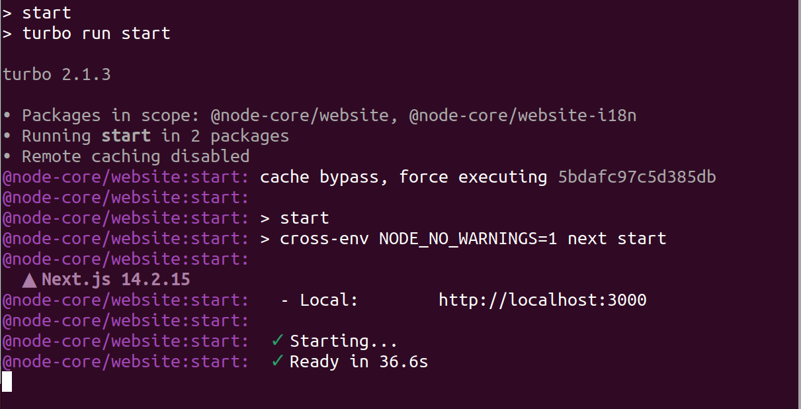
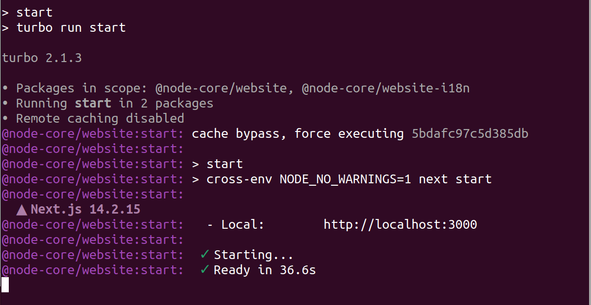
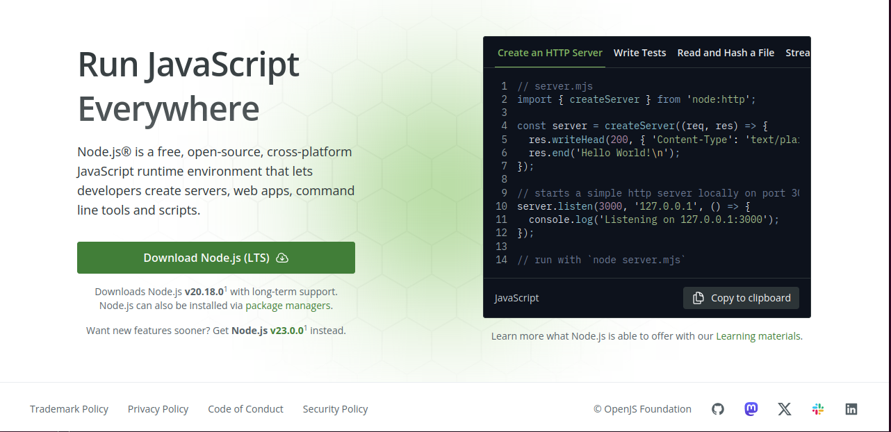
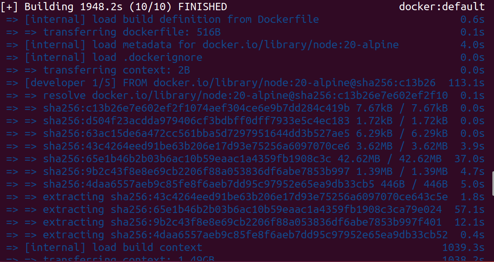
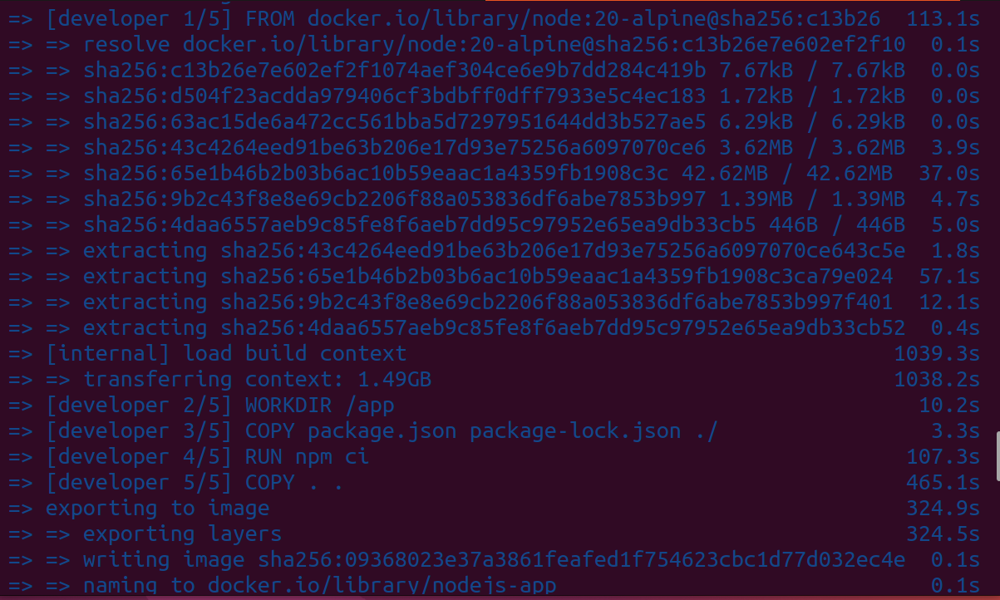
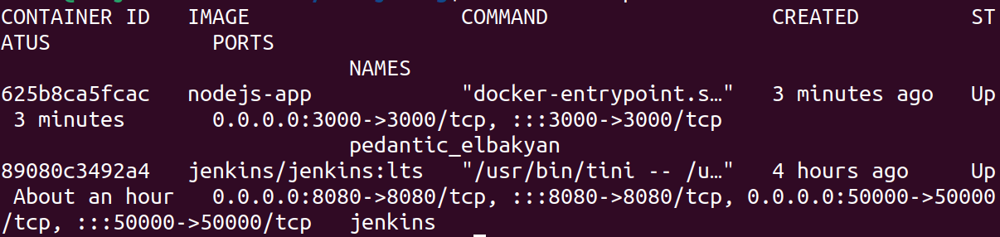

# Kubernetes Cluster Setup with Jenkins, ArgoCD, and Node.js Application Deployment 

## Overview

This project demonstrates deploying a **Node.js** application from a GitHub repository to a **Kubernetes cluster** using **Minikube** and **ArgoCD**. We also set up a **Jenkins pipeline** to automate the build, testing, and deployment process, including **pushing the Docker image to DockerHub**.

---

## Prerequisites

### Virtual Machines Required

1. **VM 1**: Jenkins Server  
   - Docker installed  
   - Jenkins installed  

2. **VM 2**: Kubernetes Cluster  
   - Minikube installed  
   - kubectl installed  
   - ArgoCD installed  

---

## Part 1: Jenkins Setup and Dockerization

### Step 1: Fork the Node.js Repository

1. Go to the **[Node.js GitHub repository](https://github.com/nodejs/nodejs.org.git)**.
2. Click **Fork** to create a copy under your GitHub account.

---

### Step 2: Clone the Repository on Jenkins VM

In the terminal, clone your forked repository:

```bash
git clone https://github.com/<your-username>/nodejs.org.git
cd nodejs.org
```

### Step 3: Build and Test the Application Locally

1. Install Node.js v20 on your VM.
2. Navigate to the project directory and install dependencies:

   ```bash
   npm install
   ```

3. Run unit tests:

   ```bash
   npm test
   ```

**Example Screenshots of Output:**

-   
-   
- 

---

### Step 4: Create a Dockerfile and Push It to GitHub

1. In your project directory, create a Dockerfile for the Node.js application.
2. Push the Dockerfile to your GitHub repository:

   ```bash
   git add Dockerfile
   git commit -m "Add Dockerfile"
   git push origin main
   ```

**Example Screenshots of Dockerfile Process:**

-   
-   
-   

---

### Step 5: Set Up the Jenkins Pipeline

Configure Jenkins to automate the build, test, and push steps.

**Pipeline Setup Screenshot:**

- 

Once the pipeline is configured, Jenkins will push the Docker image to DockerHub.

**DockerHub Push Confirmation Screenshot:**

- 

---

## Part 2: Kubernetes Deployment

Next, we’ll deploy the Node.js application on a Kubernetes cluster using Minikube and manage it with ArgoCD for continuous delivery. A `deployment.yaml` file will be version-controlled in GitHub.

### Prerequisites
- Virtual Machine with Minikube installed
- kubectl installed
- ArgoCD installed on Minikube
- GitHub Repository (e.g., `https://github.com/MuhamedMaher/nodejs.org.git`)
- Docker Hub account with your Docker image

### Step 1: Install Minikube and kubectl

1. Install Minikube:

   ```bash
   curl -Lo minikube https://storage.googleapis.com/minikube/releases/latest/minikube-linux-amd64
   sudo install minikube /usr/local/bin/
   ```

2. Install kubectl:

   ```bash
   curl -LO "https://dl.k8s.io/release/$(curl -L -s https://dl.k8s.io/release/stable.txt)/bin/linux/amd64/kubectl"
   chmod +x kubectl
   sudo mv kubectl /usr/local/bin/
   ```

3. Start Minikube:

   ```bash
   minikube start
   ```

---

### Step 2: Install ArgoCD on Minikube

1. Create a namespace for ArgoCD:

   ```bash
   kubectl create namespace argocd
   ```

2. Install ArgoCD:

   ```bash
   kubectl apply -n argocd -f https://raw.githubusercontent.com/argoproj/argo-cd/stable/manifests/install.yaml
   ```

3. Expose ArgoCD server locally:

   ```bash
   kubectl port-forward svc/argocd-server -n argocd 8080:443
   ```

4. Access ArgoCD at https://localhost:8080  
   - Username: `admin`
   - Password: Retrieve it with:

     ```bash
     kubectl get secret -n argocd argocd-initial-admin-secret -o jsonpath="{.data.password}" | base64 -d
     ```

---

### Step 3: Create Kubernetes Deployment and Service Files

Create `deployment.yaml` and `service.yaml` for your Node.js app, then add them to GitHub to allow ArgoCD to track them.

### Step 4: Push Kubernetes Configuration Files to GitHub

Commit and push the Kubernetes configuration files to GitHub, enabling ArgoCD to manage updates automatically.

### Step 5: Deploy the Node.js App on Kubernetes

**Deployment Screenshot:**

- 

---

### Step 6: Configure ArgoCD to Manage the Deployment

Connect ArgoCD to the GitHub repository and configure it to monitor changes in your Kubernetes deployment files.

**ArgoCD Configuration Screenshot:**

- 

---

## Conclusion

With this setup, the Node.js application is successfully deployed on a Kubernetes cluster using Minikube, with continuous delivery managed by ArgoCD. Any updates to the `k8` directory in the GitHub repository will automatically trigger deployment updates in the cluster.

**Final Deployment Screenshot:**

- 
